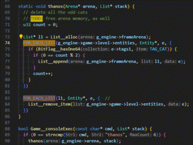

# Metacode

A meta-programming tool.  
Written in Node.js, for use on the command-line.  
This repo contains a single executable: the compiler and filesystem watcher.

Features:
- Using the multi-line comment syntax of any programming language,
- Write Metacode within the same code file you wish to compile output into!
- The compiler provides an `fs.watch()` feature to detect changes and automatically recompile on save.
- So from within your favorite IDE, use File Save (Ctrl+S) to see compiled meta-program output injected below your `#metagen` code comments.
- Compatible with any existing code format-on-save feature of your IDE.

## Screenshot
  
See also: [video](docs/video/metacode.mp4)

## Usage

One-shot
```
C:\> npx metacode tests/fixtures/test.c
```

Watch mode
```
C:\> set WATCH=1 && npx metacode tests/fixtures/test.c
```

## Example 1

- **GOAL**: Generate valid C code, using templates. Define these one place, and they update everywhere.
- **PROBLEM**: To write repetitive C code by hand is toilsome work. (In this case, we need many `typedef enum` declarations.)
- **SOLUTION**: We utilize the following Metacode to define the pattern of C `typedef enum` code we wish to repeat, using a `#macro` template.
  We then invoke the macro, passing in our `#table` data, to output various `enum` implementations.

```c
// #metacode
// #macro ENUM(name,t)
//   // {{name}}.h
//   typedef enum
//   {
//     {{~#for _i,r of t~}}
//     {{name}}_{{r.k}},
//     {{~/for~}}
//     {{name}}__COUNT
//   } {{name}};
//
//   extern char* {{name}}__STRINGS[{{#t}}];
//
//   // {{name}}.c
//   char* {{name}}__STRINGS[{{#t}}] =
//   {
//     {{~#for r of t~}}
//     "{{r.k}}",
//     {{~/for~}}
//   };
//
// #table T_CAT_BREEDS
//   k          |
//   Persian    |
//   MaineCoon  |
//   Siamese    |
//   Bengal     |
//
// ENUM(CatBreed, T_CAT_BREEDS)
// #metagen
// CatBreed.h
typedef enum
{
  CatBreed_Persian,
  CatBreed_MaineCoon,
  CatBreed_Siamese,
  CatBreed_Bengal,
  CatBreed__COUNT
} CatBreed;

extern char* CatBreed__STRINGS[4];

// CatBreed.c
char* CatBreed__STRINGS[4] =
{
  "Persian",
  "MaineCoon",
  "Siamese",
  "Bengal",
};
// #metaend
```

- **ALTERNATIVE BENEFITS**: Our tabular data format further reduces repetition (and is an improvement over the older competing solution of C preprocessor macros),
  if you imagine that some use cases might require thousands of rows of table data.

## Example 2

- **PROBLEM**: Iterating linked lists can be toilsome. Using a macro would prevent interactive debugging. 
- **SOLUTION**: We first define the `FOR_EACH_LIST()` macro. This could be in any included file (using the C preprocessor `#include`).
  Then later, we invoke the macro (as many times as we like).

```c
// List.h
// #metacode
// #macro FOR_EACH_LIST(LIST, TYPE, ITEM)
//   List__Node* __node = {{LIST}}->head;
//   u32 __len = {{LIST}}->len; // cache; may mutate
//   for (u32 __i = 0; __i < __len; __i++) {
//     {{TYPE}} {{ITEM}} = __node->data;
//     __node = __node->next;
// #metaend

// EventEmitter.c
#include "List.h"

// Dispatch an event to all listeners
void EventEmitter__emit(
    Arena* arena,
    EventEmitter* emitter,
    EventType event,
    void* source,
    void* data,
    Dispatcher__call_t cb) {
  // find EventTuple1 by EventType
  // #meta FOR_EACH_LIST(emitter->events, EventTuple1*, tup)
  List__Node* __node = emitter->events->head;
  u32 __len = emitter->events->len; // cache; may mutate
  for (u32 __i = 0; __i < __len; __i++) {
    EventTuple1* tup = __node->data;
    __node = __node->next;
    // #metaend
    if (tup->event == event) {
      // iterate Listeners
      // #meta FOR_EACH_LIST(tup->listeners, c2, EventTuple2*, v)
      List__Node* __node = tup->listeners->head;
      u32 __len = tup->listeners->len; // cache; may mutate
      for (u32 __i = 0; __i < __len; __i++) {
        c2 EventTuple2* = __node->data;
        __node = __node->next;
        // #metaend
        EventEmitterParams* params = Arena__Push(arena, sizeof(EventEmitterParams));
        params->source = source;
        params->target = v->target;
        params->data = data;
        // invoke callback
        cb(v->listener, params);
      }
    }
  }
}
```

## Metacode

Rules:
- all lines must begin with C inline comment `//`
  - each instance must be a contiguous block, as shown in the examples
  - no uncommented/code lines allowed outside of `#metagen` and `#metaend`
- `#metacode`
  - must begin the comment block.
  - distinguishes comment block as a meta-program translation unit
  - *identifiers* which are globally unique may be referenced later by other `#metacode`
  - any lines under this one, other than `#<directive>` lines, are considered CODE statements; these can invoke macros defined earlier.
- `#macro`
  - optional; use zero or more times
  - defines a macro which can be called from `#metacode` or `#meta`
  - inspired by C preprocessor macros
  - (meaningful indentation) 2-space indentation is required (not for your code, but to end the macro definition)
    ```
    #macro FUNCTION_NAME(PARAM1)
      FUNCTION_BODY
    ```
  - `FUNCTION_NAME` and `PARAMS` are any valid *identifier* (user-defined)
  - `FUNCTION_NAME` identifies this macro *instance*, is *globally scoped*, and must be *unique*
  - `PARAMS` are *locally-scoped*, and must only be unique within this macro instance
  - `FUNCTION_BODY` is valid template syntax (user-defined; see **Handlebars** section below)
- `#table TABLE_NAME`
  - optional; use zero or more times
  - inspired by Markdown (see *(Markdown table** section below)
  - defines data for the template to iterate over
    - data structure is an array of objects (similar to CSV/spreadsheet)
  - `TABLE_NAME` is any valid *identifier* (user-defined)
  - `TABLE_NAME` identifies this table *instance*, is *globally scoped*, and must be *unique*
  - table body must appear on new line, indented below
    - end of table block is determined by *meaningful indentation* (like Python)
- (implicit; in the remaining space between `#metacode` and `#metagen`, other than for `#table` and `#macro` use)
   - shall contain `#macro` `FUNCTION_BODY` definitions (similar to the C preprocessor)
     - without it, there are no macros defined to invoke later (there are no standard set of default macros provided)
     - this is the most common use case for `#metacode` (use it to define your library of macro functions)
   - and/or shall contain `CODE` statements, mainly macro function invocations (by the macro name you define prior)
     - without it no meta-program `#macro` is ultimately able to be executed, therefore no output can be generated.
- `#meta CODE`
  - this is an alternative to the `#metacode ... #metagen ... #metaend` multi-line block.
  - it instead lets you invoke a macro in just a single line `#meta CODE ... #metaend` (or two lines, if you count `#metaend`)
  - `CODE` is your statement which can invoke previously defined macros
  - ie. use this to invoke macros quickly
- `#metagen`
  - begins the space between `#metagen ... #metaend` (not used for `#meta CODE ... #metaend`)
- `#metaend`
  - **REQUIRED!** the line above this directive is only space where meta-program compiler output can appear.
  - required to follow if `#metagen` or `#meta` were used
  - delineates the end of the comment block

### Syntax

Multi-line invocation

```c
  // #metacode
  // #macro FUNCTION_NAME(PARAM1,PARAM2) ...
  // #table TABLE_NAME ...
  // ...
  // #metagen
  ...
  // #metaend
```

or...

Single-line invocation

```c
  // #meta CODE
  ...
  // #metaend
```

### ABNF

```abnf
  id           = /\w[\w\d_]+/
  inline-block = CHAR+
  block        = "|" (LWSP CHAR)+
  metacode     = "#metacode"
  macro        = "#macro" WSP+ id "(" (id ","?)* ")" (inline-block|block)
  table        = "#table" WSP+ id (inline-block|block)
  meta         = "#meta" WSP+ inline-block
  metagen      = "#metagen"
  metaend      = "#metaend"
```

**NOTICE:** Throughout this document, our use of ABNF syntax is modified in the following ways:
- We use regular expression syntax (ie. `*`, `+`, `?`, `()*`, `/.../`, `\w`, `\d`, `\s`, `(|)`),  
  as an alternative to the ABNF syntax (ie. `*()`, `1-8()`),  
  because regex is more concise and expressive when describing repetition and character classes.

## Handlebars template

Used only within the body of a `#macro` definition.

Our implementation of Handlebars is not an exact-match;  
its feature-set is only partially implemented here, and  
we took the following liberties to change its syntax:
- looping over `#table` data
  - valid JavaScript (ES6) syntax:
    - `for idx,row of t` (key-value iteration), ie.
      - `idx` copy of uint array index (user-named variable)
      - `row` ref to object value (user-named variable)
      - `t` ref to table data (user-named variable)
    - `for idx in t` (key iteration)
    - `for row of t` (value iteration)
  - variation of Handlebars syntax:
    - `for t` (value iteration; row is named `this`)
    - close with `/for`
    - control whitespace using `{{~` (ltrim) and/or `~}}` (rtrim)
- utility functions
  - variation of Lua syntax
    - `#t` (where `t` is a user-named variable referring to a `#table`,  
      this will return the count of rows in that table)

### Syntax example
Given the following table:
```markdown
  name    | age |
  alice   | 11  |
  bob     | 24  |
  charles | 36  |
```

And given the following template:
```handlebars
  typedef struct {
    char* name;
    u8 age;
  } Person_t;
  {{~#for idx,row of t~}}
  Person_t* p{{idx}} = { .name = "{{row.name}}", .age = {{row.age}} };
  {{~/for~}}
  u32 PEOPLE_COUNT = {{#t}};
```

Then the compiler will output:
```c
  typedef struct {
    char* name;
    u8 age;
  } Person_t;
  Person_t* p0 = { .name = "alice", .age = 11 };
  Person_t* p1 = { .name = "bob", .age = 24 };
  Person_t* p2 = { .name = "charles", .age = 36 };
  u32 PEOPLE_COUNT = 3;
```

## Markdown table

Our implementation of Markdown is not an exact-match;  
only its table feature is implemented here, and  
we took the following liberties to change its syntax:

- header is required
- header/body divider are omitted
- outer column dividers are omitted
- column dividers are optional if there is only one column

### Syntax example
```markdown
  k          |
  Persian    |
  Maine Coon |
```
### ABNF
```
  row = LWSP (CHAR* "|"?)+
```

## Inspirations

This project combines ideas from:
- c preprocessor macros
- yaml multi-line strings
- markdown tables
- handlebars templates
- docco + literate coffeescript
- managed files w/ generated code
- protobuf
- gulpjs
- lua
- clang format-on-save

Similar work:
- Ryan Fleury
  - [ryanfleury/metadesk](https://github.com/ryanfleury/metadesk/tree/master) Github repo
    - [conceptual introduction](https://www.rfleury.com/p/table-driven-code-generation)